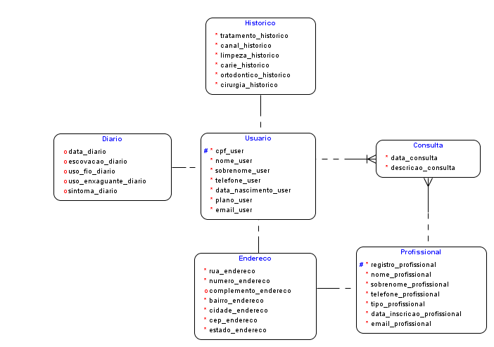
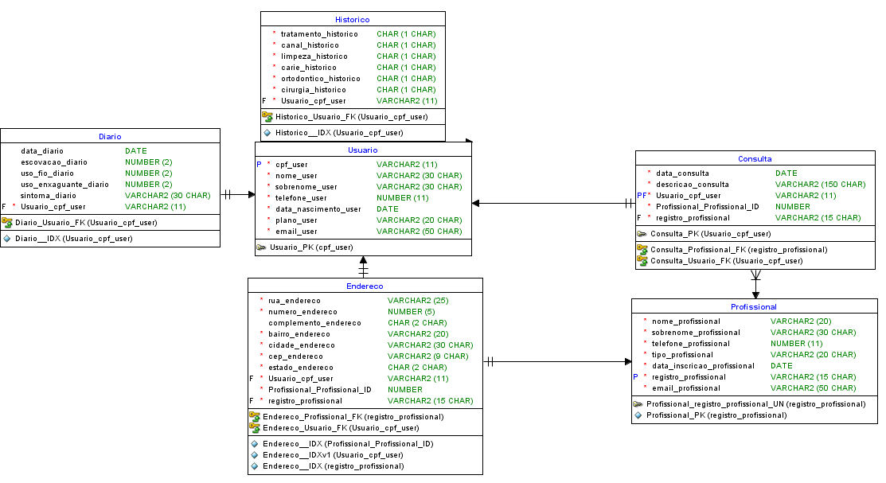

<h1 align="left"> Challenge Odontoprev: Devops</h1>
<p align="left">O projeto N.I.B. visa desenvolver um aplicativo que permite aos segurados da Odontoprev monitorar suas rotinas diárias, coletando informações sobre hábitos de saúde e bem-estar. Utilizando modelos de inteligência artificial, o aplicativo prevê a probabilidade de acionamento de sinistros para procedimentos odontológicos mais custosos.</p>

<h2 align="left">Benefícios do Aplicativo</h2>
<ul>
  <li>🩺 <strong>Monitoramento de Saúde:</strong> Acompanhe o cotidiano do seu usuário, bem como as condições de sua saúde bucal.</li>
  <li>⚠️ <strong>Prevenção e Intervenção:</strong> Identifique padrões e anomalias para intervenções precoces.</li>
  <li>📱 <strong>Acesso Facilitado:</strong> Acesso prático e personalizado a dados de saúde.</li>
  <li>🤖 <strong>Dados para Inteligência Artificial:</strong> Geração de base de dados para modelos de IA que atendam necessidades da empresa.</li>
</ul>

<h2 align="left">Objetivos do Projeto</h2>
<ul>
  <li>📊 <strong>Monitoramento de Rotinas:</strong> Registro das atividades diárias dos usuários.</li>
  <li>🔍 <strong>Identificação de Tendências:</strong> Análise de dados para reconhecer perfis propensos a intervenções de alto custo.</li>
  <li>🔒 <strong>Autenticidade e Confiabilidade:</strong> Verificação cruzada realizada por profissionais de odontologia.</li>
</ul>

<h2 align="left">Tecnologias Utilizadas</h2>
<ul>
  <li>⚙️ <strong>Backend:</strong> Java com Spring.</li>
  <li>🐄️ <strong>Banco de Dados:</strong> Oracle.</li>
  <li>🧠 <strong>Inteligência Artificial:</strong> Modelos de machine learning com Python para análise de dados.</li>
  <li>📱 <strong>Aplicativo:</strong> Construção de aplicativo de tela com a linguagem Kotlin.</li>
</ul>

<h2 align="left"> 📹 Link do vídeo</h2>

```bash
https://www.youtube.com/watch?v=4L5RpHhTqTg
```
<h3 align="left"> Desenho - Pipeline</h3>


<h2 align="left"> 🏠 Relacionamentos: Visão banco</h2>

<h3 align="left"> 🏠 Modelo Lógico </h3>
  

<h3 align="left"> 🏠 Modelo Físico </h3>
  

<h2 align="left">	🧮 Testes 🧮</h2>

<h3 align="left"> 🧙‍♀️ Usuário</h3>
<ul>
  <li><strong>Nome:</strong> Usuário</li>
  <li><strong>Sobrenome:</strong> Testte</li>
  <li><strong>CPF:</strong> 98684948009</li>
  <li><strong>Telefone:</strong> 1234567890</li>
  <li><strong>E-mail:</strong> maria.fogolin@example.com</li>
  <li><strong>Data de Nascimento:</strong> 01/01/1990</li>
  <li><strong>Plano:</strong> Premium</li>
</ul>

<ul>
  <li><strong>Nome:</strong> Igor</li>
  <li><strong>Sobrenome:</strong> Gabriel</li>
  <li><strong>CPF:</strong> 54483739093</li>
  <li><strong>Telefone:</strong> 11982657485</li>
  <li><strong>E-mail:</strong> igor@gmail.com</li>
  <li><strong>Data de Nascimento:</strong> 2025-05-16</li>
  <li><strong>Plano:</strong> Premium</li>
</ul>

<ul>
  <li><strong>Nome:</strong> Nicholas</li>
  <li><strong>Sobrenome:</strong> Lima</li>
  <li><strong>CPF:</strong> 42771372029</li>
  <li><strong>Telefone:</strong> 1126547893</li>
  <li><strong>E-mail:</strong> nicholas@gmail.com</li>
  <li><strong>Data de Nascimento:</strong> 04/07/1998</li>
  <li><strong>Plano:</strong> Premium</li>
</ul>

<h3 align="left"> 👷‍♀️ Profissional</h3>
<ul>
  <li><strong>Nome:</strong> João</li>
  <li><strong>Sobrenome:</strong> Silva</li>
  <li><strong>Telefone:</strong> 11987654321</li>
  <li><strong>E-mail:</strong> joao.silva@exemplo.com</li>
  <li><strong>Data de cadastro:</strong> 27/09/2024</li>
  <li><strong>Registro do Profissional:</strong> 0123456789</li>
  <li><strong>Tipo do profissional:</strong> Dentista</li>
</ul>

<ul>
  <li><strong>Nome:</strong> Marcelo</li>
  <li><strong>Sobrenome:</strong> Pedro</li>
  <li><strong>Telefone:</strong> 11175648539</li>
  <li><strong>E-mail:</strong> joao.silva@exemplo.com</li>
  <li><strong>Data de cadastro:</strong> 25/03/2025</li>
  <li><strong>Registro do Profissional:</strong> rg1234</li>
  <li><strong>Tipo do profissional:</strong> Dentista</li>
</ul>


<h2 align="left"> 🤝 Integrantes</h2>
<ul>
  <li>Igor Gabriel Pereira Marcondes <strong>RM 553544</strong></li>
  <li>Maria Beatriz Reis Fogolin de Godoy <strong>RM 552669</strong></li>
  <li>Nicholas Pereira Paulo Lima Barbosa <strong>RM 552744</strong></li>
</ul>
